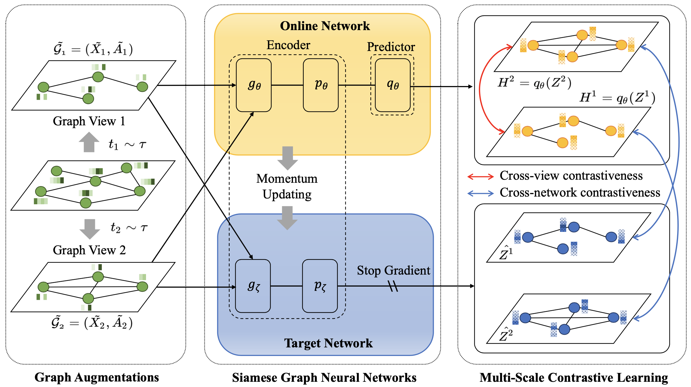

# MERIT

<p align="center">

</p>

A PyTorch implementation of our IJCAI-21 paper [Multi-Scale Contrastive Siamese Networks for Self-Supervised Graph Representation Learning](https://arxiv.org/abs/2105.05682).

## Dependencies
+ Python (>=3.6)
+ PyTorch (>=1.7.1)
+ NumPy (>=1.19.2)
+ Scikit-Learn (>=0.24.1)
+ Scipy (>=1.6.1)
+ Networkx (>=2.5)

To install all dependencies:
```
pip install -r requirements.txt
```

## Usage
Here we provide the implementation of MERIT along with Cora and Citeseer dataset.

+ To train and evaluate on Cora:
```
python run_cora.py
```

+ To train and evaluate on Citeseer:
```
python run_citeseer.py
```

## Citation
If you use our code in your research, please cite the following article:
```
@inproceedings{Jin2021MultiScaleCS,
  title={Multi-Scale Contrastive Siamese Networks for Self-Supervised Graph Representation Learning},
  author={Ming Jin and Yizhen Zheng and Yuan-Fang Li and Chen Gong and Chuan Zhou and Shirui Pan},
  booktitle={The 30th International Joint Conference on Artificial Intelligence (IJCAI)},
  year={2021}
}
```
